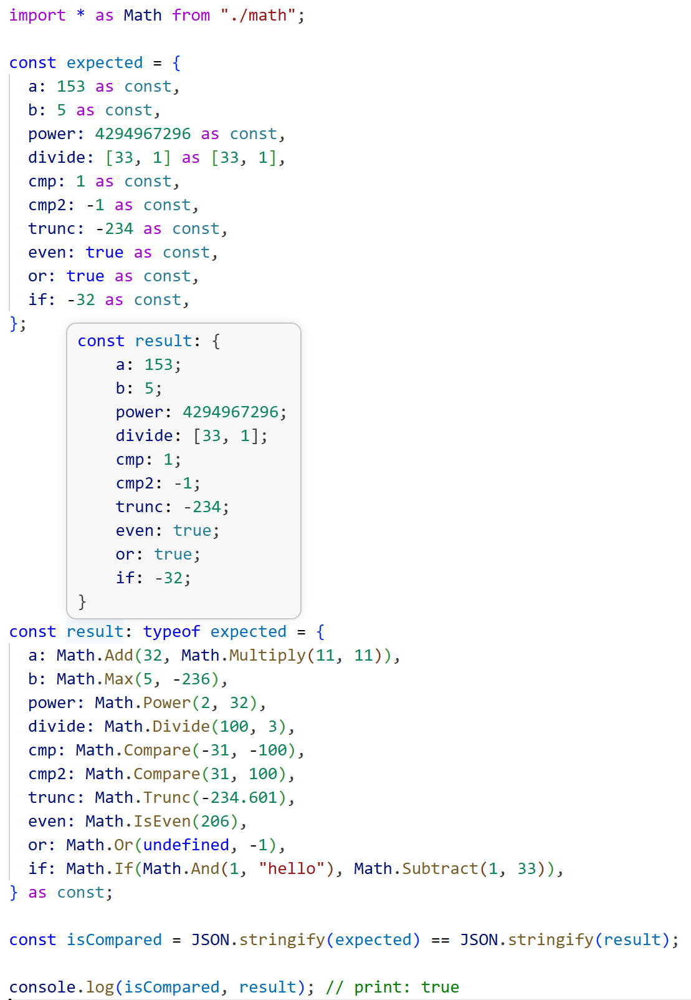
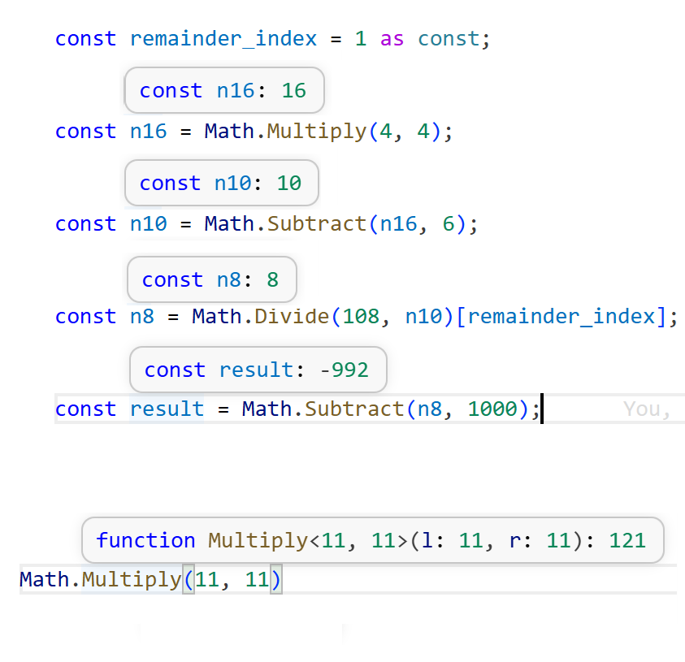

# ts-overkill

Репозиторий содержит набор runtime-обёрток для математических операций с усиленной TypeScript-типизацией.

- `math.ts` реализует арифметику и логические операции: `Add`, `Subtract`, `Multiply`, `Divide`, `Power`, `Compare`, `Trunc`, `IsEven`, `Or`, `And`, `If` и другие.
- Эти функции возвращают значения, совместимые с типами из `ts-overkill`, импортированными в `math.ts`.
- `main.ts` собирает результат с явными `as const` типами и проверяет его соответствие ожидаемому объекту через `JSON.stringify`.

## Цель

Показать подход, где runtime-вычисления выполняются через функции, а TypeScript статически выводит точные числовые и логические результаты.

## Примеры

